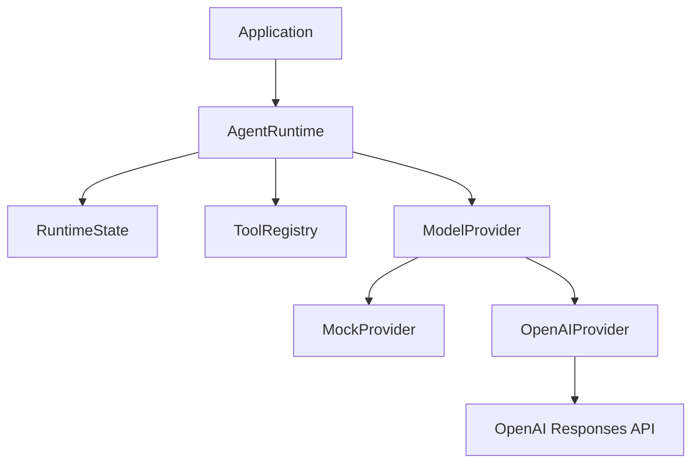

# ai-runtime

[](https://github.com/xxj-666/ai-runtime/actions/workflows/ci.yml)

ai-runtime is an early-stage, model-agnostic Python runtime for building agents
whose tools and execution state are not owned by a model provider.

The project explores a simple idea: models are replaceable compute backends,
while an application's tools, state, memory, workflows, permissions, and
operational context should live in a separate runtime layer.

> **Status:** `v0.1.0-alpha` is an experimental release. Public APIs may change.
> This project is not production-hardened.

## Why ai-runtime?

Agent applications often mix orchestration, state, tool execution, and a
provider SDK in the same code path. That makes provider changes expensive and
can turn model history into application state by accident.

ai-runtime puts a small provider-neutral boundary between the runtime and model
APIs. The current code proves that boundary with an offline deterministic
provider and an optional OpenAI adapter.

## What works today

### Implemented

- A synchronous `ModelProvider` protocol.
- A bounded `AgentRuntime` model/tool loop.
- Explicit tool registration with JSON Schema definitions.
- In-memory provider-neutral runtime state.
- A deterministic `MockProvider` requiring no API key.
- An optional OpenAI Responses API adapter.
- Offline tests and a runnable example.

### Experimental

- The public Python API and state model.
- OpenAI function-call translation.
- Strict tool-schema validation.

### Planned

- Additional provider adapters.
- Persistent memory and state storage.
- Async execution and streaming.
- Tool permissions and confirmation policies.
- Workflows, observability, evaluations, and MCP support.
- Enterprise isolation and local-model integration.

See the [roadmap](docs/roadmap.md) for directional plans.

## Architecture



Only the components shown above are implemented. Persistent memory,
permissions, workflows, and other enterprise capabilities are planned.

Read [Architecture](docs/architecture.md) and [Concepts](docs/concepts.md) for
the detailed boundaries.

## Quick start

Prerequisites:

- Python 3.11 or newer
- [uv](https://docs.astral.sh/uv/)

```bash
git clone https://github.com/xxj-666/ai-runtime.git
cd ai-runtime
uv sync
uv run pytest
uv run ruff check .
uv run ruff format --check .
uv run python examples/basic_runtime.py
```

The default example is deterministic and does not require a network connection
or API key. Expected output:

```text
2 + 3 = 5
provider_calls=2 tool_calls=1
```

## Minimal example

```python
from ai_runtime import AgentRuntime, ModelResponse
from ai_runtime.providers import MockProvider

provider = MockProvider([ModelResponse(content="Hello from a portable runtime.")])
result = AgentRuntime(provider).run("Hello")
print(result.output)
```

See [`examples/basic_runtime.py`](examples/basic_runtime.py) for a complete tool
call round trip.

## Optional OpenAI adapter

OpenAI support is isolated in an optional dependency:

```bash
uv sync --extra openai
cp .env.example .env
```

Set `OPENAI_API_KEY` and an `OPENAI_MODEL` available to your account, export the
variables into your shell, then run:

```bash
uv run python examples/openai_runtime.py
```

The OpenAI example is not part of the default tests and CI never requires a
real API key.

## Design principles

- **Provider boundaries:** vendor-specific translation stays in adapters.
- **Portable state:** runtime state uses project-owned data structures.
- **Explicit tools:** schemas and handlers are registered intentionally.
- **Bounded execution:** tool loops stop at a configured step limit.
- **Reproducibility:** the default development path is deterministic and
  offline.
- **Security by design:** security boundaries are documented, while incomplete
  protections are not presented as implemented.

## Contributing

Early contributions are welcome. Start with [CONTRIBUTING.md](CONTRIBUTING.md)
and open an issue before proposing a large architecture change.

## Security

Do not report sensitive vulnerabilities in a public issue. See
[SECURITY.md](SECURITY.md) for the current reporting process and security scope.

## License

Licensed under the Apache License, Version 2.0. See [LICENSE](LICENSE).
