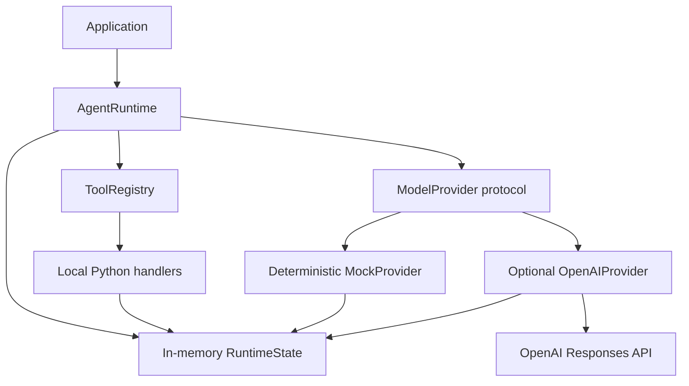

# Architecture

ai-runtime separates durable runtime concerns from model-provider APIs. The
current alpha is intentionally a small, synchronous library; it is not an
enterprise platform or a complete AI operating system.

## Current architecture

### Application layer

An application creates a provider, registers explicit tools, and calls
`AgentRuntime.run`. There is no HTTP application layer in the current release.

### Agent runtime

`AgentRuntime` owns a bounded loop:

1. append the user input to runtime state;
2. send a provider-neutral `ModelRequest` to the selected provider;
3. return final text, or execute requested tools;
4. append tool calls and results to state;
5. repeat until final text or the configured step limit.

The runtime does not import provider SDKs.

### State

`RuntimeState` is an in-memory, provider-neutral sequence of user messages,
assistant messages, tool calls, and tool results. It also records provider and
tool call counts. Persistence, storage backends, and migration formats are not
implemented yet.

### Tools

Tools are explicit Python callables paired with a JSON Schema. The registry
rejects duplicate names, unknown tools, invalid Python arguments, handler
failures, and non-JSON-serializable outputs. The alpha does not provide a
sandbox or permission system, so applications must only register handlers they
trust.

### Model interface

`ModelProvider` is a synchronous protocol that accepts `ModelRequest` and
returns `ModelResponse`. Responses contain either final text or one or more
portable tool calls.

### Provider adapters

- `MockProvider` is deterministic and requires no network or API key.
- `OpenAIProvider` is an optional adapter for the OpenAI Responses API. Its SDK
  dependency and wire-format translation remain inside the adapter.

## Failure boundaries

The runtime uses explicit exceptions for provider configuration, invalid
provider responses, duplicate or unknown tools, invalid arguments, tool
failures, and step-limit exhaustion. It does not retry network requests or tool
side effects in the alpha.

## Planned architecture

The following are directions, not current capabilities:

- persistent state and memory backends;
- additional model-provider adapters;
- permission and tool-execution policies;
- asynchronous and streaming execution;
- workflow orchestration;
- observability and evaluation hooks;
- tenant and business-context isolation.
